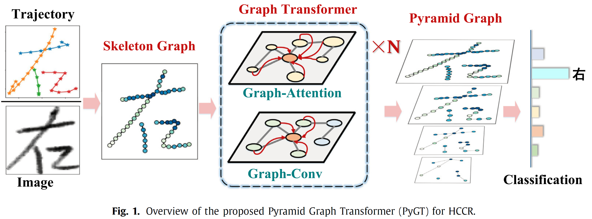

# PyGT


## Introduction
This is a PyTorch implementation of the paper **"Characters as graphs: Interpretable handwritten Chinese character
recognition via Pyramid Graph Transformer"** (authored by **Ji Gan, Yuyan Chen, Bo Hu, Jiaxu Leng∗, Weiqiang Wang, Xinbo Gao*.** )

PyGT (Pyramid Graph Transformer) proposes to represent handwritten characters as skeleton graphs and furhter processes the graph-structured characters by integrating the advantages of Transformers and graph convolutional networks.


## Overview of PyGT


## Installation & requirements
The current version of the code has been tested with the following environment:
- Ubuntu 20 or 22
- Python 3
- PyTorch 1.11.0
- Pytorch_geometric 2.0.4


To use the code, download the repository and change into it:

`git https://github.com/ganji15/PyGT-HCCR.git`

`cd PyGT`

For online & offline handwritten Chinese character recognition (HCCR), You need to applicant the HCCR dataset from <http://www.nlpr.ia.ac.cn/databases/handwriting/download.html> and then extract the handwriting samples. 
For convenience, here we provide the processed data files [on_hccr.zip](https://github.com/ganji15/PyGT/releases/download/dataset/xxx)  [off_hcc.zip](https://github.com/ganji15/PyGT/releases/download/dataset/xx), and [gen_off_hcc.zip](https://github.com/ganji15/PyGT/releases/download/dataset/xx.), which should be extracted and put the extracted folder into the **./data/** directory.


## Training
### Training PyGT on MNIST with Single-GPU
`sh ./scripts/mnist_train.sh`

or

`python train.py --net-id lenet --epochs 40 --dataset mnist --workers 4  --batch-size 128  --lr 0.001  --in-features 3  --gpu-id 0`

### Training PyGT on Online HCC dataset with Multi-GPUs
`sh ./scripts/on_hccr_train.sh`

### Training PyGT on Offline HCC dataset with Multi-GPUs
`sh ./scripts/off_hccr_train.sh`

### Boost Offline HCCR witch Online Samples with Multi-GPUs
`sh ./scripts/boost_off_hccr_train.sh`

## On-the-fly plots during training
With this code it is possible to track progress during training with on-the-fly plots. This feature requires `Tensorboard`, which should be started from the command line:

`tensorboard --logdir=./runs`

The tensorboard server is now alive and can be accessed at http://localhost:6006.


## Citation
If you find our research is helpful, please remember to cite our paper:
```
@article{GAN2023PyGT,
title = {Characters as graphs: Interpretable handwritten Chinese character recognition via Pyramid Graph Transformer},
journal = {Pattern Recognition},
volume = {137},
pages = {109317},
year = {2023},
issn = {0031-3203},
doi = {https://doi.org/10.1016/j.patcog.2023.109317},
author = {Ji Gan and Yuyan Chen and Bo Hu and Jiaxu Leng and Weiqiang Wang and Xinbo Gao},
}
```

## License
PyGT is free for academic research purposes.